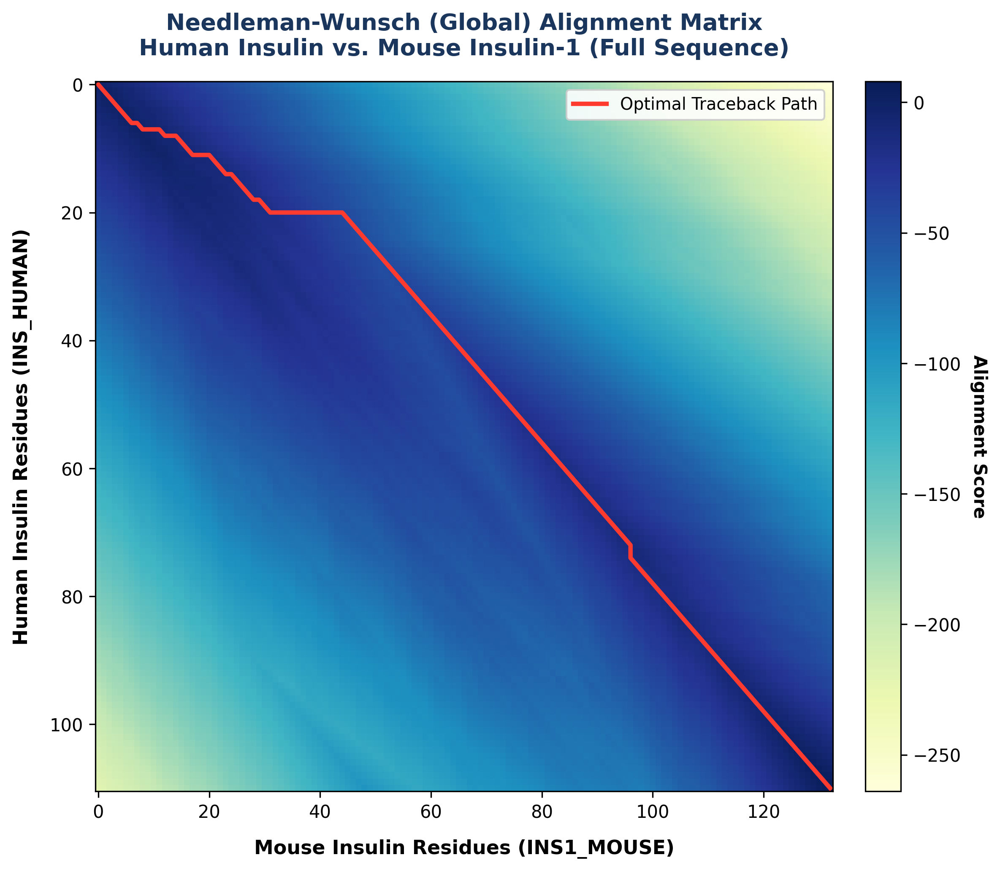
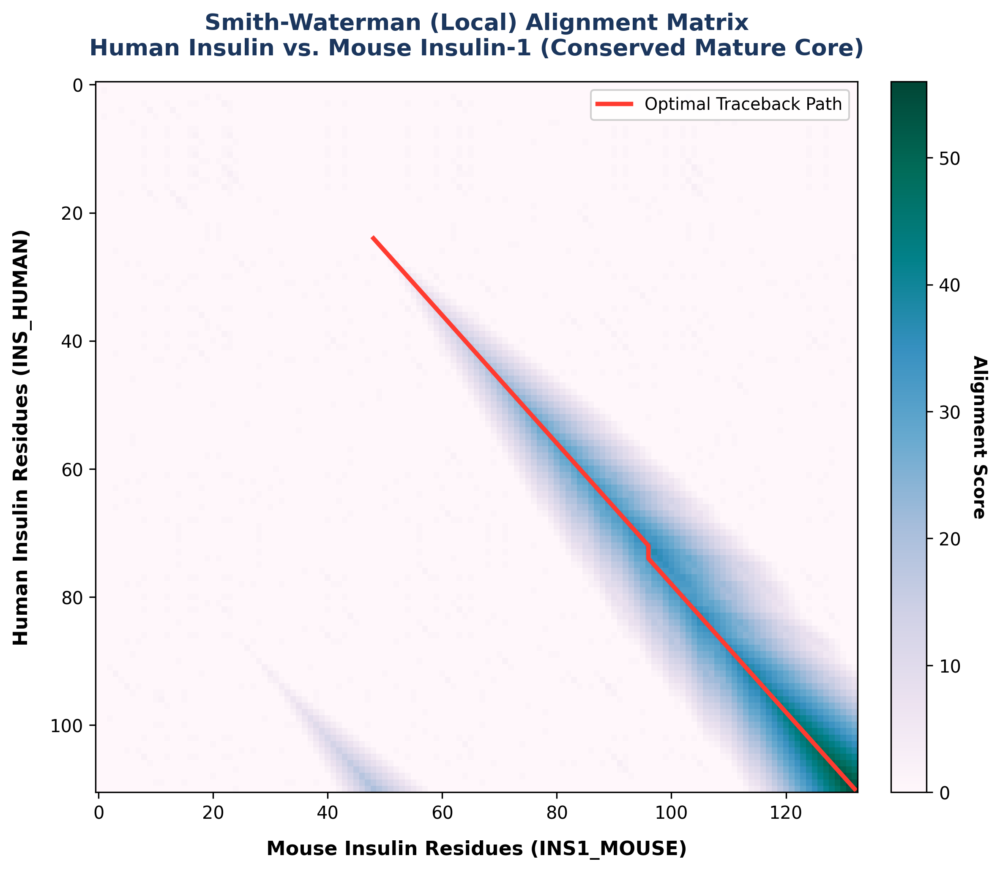

# Pairwise Sequence Aligner

A Python 3 implementation of classic pairwise sequence alignment algorithms using dynamic programming. This tool supports global and local alignment of DNA, RNA, and protein sequences.

## Features

- **Global Alignment (Needleman-Wunsch):** Best fit alignment spanning the entire length of both sequences.
- **Local Alignment (Smith-Waterman):** Finds the optimal matching local sub-segment/substring within two sequences.
- **Customizable Scoring Parameters:** Easily adjust rewards for matches and penalties for mismatches and gaps.
- **CSV Matrix Export:** Export the complete calculated dynamic programming scoring matrix to a CSV file.
- **Visual Output:** Generates a formatted alignment output displaying identity percentages, matches (`|`), and mismatches (`.`).

---

## Getting Started

### Prerequisites

You will need **Python 3.6+** installed on your system.

### Running the Aligner

Run the script directly from your terminal.

#### 1. Quick Demo (Default Sequences)
Runs global alignment on sample strings `HELLO` vs `CELLO`:
```bash
python aligner.py
```

#### 2. Aligning Direct Strings (Global Mode)
```bash
python aligner.py -s1 GATTACA -s2 GCATCA --mode global --show-matrix
```

#### 3. Aligning FASTA Files (Local Mode)
You can specify biological sequences stored in FASTA format:
```bash
python aligner.py -f1 human_insulin.fasta -f2 mouse_insulin.fasta --mode local --export-csv insulin_matrix.csv
```

### CLI Arguments

| Argument | Description | Default |
| :--- | :--- | :--- |
| `-s1` / `--seq1` | First sequence string | |
| `-f1` / `--file1` | Path to first FASTA file | |
| `-s2` / `--seq2` | Second sequence string | |
| `-f2` / `--file2` | Path to second FASTA file | |
| `-m` / `--match` | Match score | `1` |
| `-ms` / `--mismatch` | Mismatch penalty | `-1` |
| `-g` / `--gap` | Gap penalty | `-2` |
| `--mode` | Alignment mode (`global` or `local`) | `global` |
| `--show-matrix` | Prints the DP matrix in terminal | (disabled) |
| `--export-csv` | File path to export scoring matrix | (disabled) |

---

## Running Unit Tests

The project includes a comprehensive suite of unit tests verifying edge cases, gap placements, and mismatch scoring. Run them using:

```bash
python -m unittest test_aligner.py
```

---

## Sample Report Format

```text
========================================
GLOBAL SEQUENCE ALIGNMENT REPORT
========================================
Sequence 1 Length: 110
Sequence 2 Length: 132
Parameters: Match=1, Mismatch=-1, Gap=-2
Alignment Score: 8
----------------------------------------
Seq1: MALWMR-L---L--PLL---ALL-ALWG-PD...
      |..|.| |   |  .||   ||| ...| .|...
Seq2: MIVWQRQLWCCLWGCLLVAYALLNQKQGIVD...

Identity: 84/134 (62.7%)
========================================
```

---

## Dynamic Programming Grid Visualizations (Human vs. Mouse Insulin)

These heatmaps display the dynamic programming scoring matrices calculated for the real sequence alignment of **Human Insulin (110 aa)** and **Mouse Insulin-1 (132 aa)**:

### 1. Global Alignment (Needleman-Wunsch Grid)
The global grid is forced to span from the N-terminus to the C-terminus of both proteins. The traceback path (shown in solid red) starts at the bottom-right corner `(110, 132)` and traces back to `(0, 0)`:



### 2. Local Alignment (Smith-Waterman Grid)
The local grid floors negative cell scores at `0`. The traceback path starts at the cell with the maximum score (`56`, representing the C-terminus of the mature functional insulin chain) and traces backwards to the start of the highly conserved mature hormone segment:

